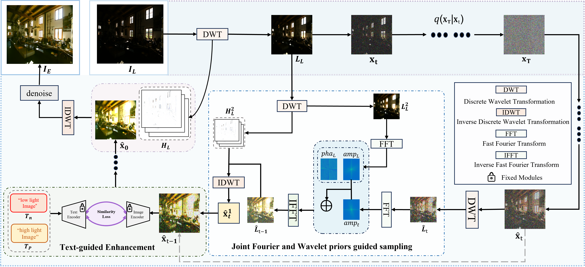

# Zero-Shot Low-Light Image Enhancement via Joint Frequency Domain Priors Guided Diffusion
Official implement of [Zero-Shot Low-Light Image Enhancement via Joint Frequency Domain Priors Guided Diffusion]([[https://arxiv.org/abs/2411.13961](https://ieeexplore.ieee.org/abstract/document/10909219)])
</div>

## Overview


## Prerequisites
- Linux
- Python 3.8
- NVIDIA GPU + CUDA CuDNN

## Installation
### Environment
```
conda env create --file environment.yml
```
### Pre-Trained Models
download this [model](https://openaipublic.blob.core.windows.net/diffusion/jul-2021/256x256_diffusion_uncond.pt)(from [guided-diffusion](https://github.com/openai/guided-diffusion)) 
```
wget https://openaipublic.blob.core.windows.net/diffusion/jul-2021/256x256_diffusion_uncond.pt
```
### Quick Start
```
 python main.py 
```
## TODO
We will open the denoising version later. Please contact us if you need our test results.
- [x] basic version
- [ ] denoising version
## Citation
If you find this code useful for your research, please use the following BibTeX entry.
```
@article{he2025zero,
  title={Zero-Shot Low-Light Image Enhancement via Joint Frequency Domain Priors Guided Diffusion},
  author={He, Jinhong and Palaiahnakote, Shivakumara and Ning, Aoxiang and Xue, Minglong},
  journal={IEEE Signal Processing Letters},
  year={2025},
  publisher={IEEE}
}

```
